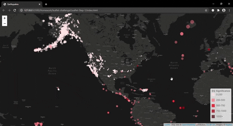
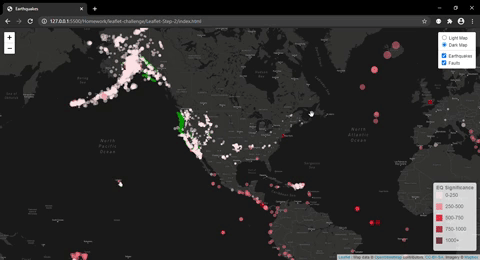

# Leaflet Homework - Visualizing Data with Leaflet

The goal of this homework was to form a map that showed earthquake and fault data.

### Earthquake Data
[Earthquake website](https://earthquake.usgs.gov/earthquakes/feed/v1.0/summary/1.0_month.geojson "USGS Website") - the USGS site that provides Earthquake data for the last month

### Fault Data
[Fault data](https://github.com/trackrun82/leaflet-challenge/blob/master/Leaflet-Step-2/static/data/qfaults_latest_quaternary.geojson) - was provided and placed in data folder

## Level 1 -
[Level 1 map](https://github.com/trackrun82/leaflet-challenge/tree/master/Leaflet-Step-1)

* A basic map was created using Leaflet that plots all of the earthquakes in the past month based on their longitude and latitude
* Data markers were added and they reflect the magnitude of the earthquake in their size and and the significance of earthquake in their color
* Earthquakes with higher magnitudes appear larger and those with higher significance appear darker in color
* A legend was also formed to show the significance color levels
* Popups provide additional information about the earthquake when a marker is clicked

## Level 2 -
[Advanced map](https://github.com/trackrun82/leaflet-challenge/tree/master/Leaflet-Step-2)

* In addition to the basic map, the advanced map includes the fault data as well
* The fault lines that had slip_rates that were either greater than 5.0 mm/yr or Between 1.0 and 5.0 mm/yr were added
* A higher stroke-weight was used for fault-lines with higher slip_rates
* Two base maps along with our two different data sets were added into overlays that can be turned on and off independently
* Popups provide additional information about the fault when a fault-line is clicked

# Conclusions

The website was published and hosted at [GitHub](https://trackrun82.github.io/leaflet-challenge/)

Looking at the earthquakes overlaid on top of the most active faults, the majority of the activity does seem to cluster around the active faults as would be expected.
However, this doesn't necessarily mean that the highest magnitude and intensity of the earthquakes will occur on these same faults.
This means that other factors come into play that may not be easily measured and/or predicted.  
The significance level would make sense to go up in more heavily populated areas as the damage would tend to be greater with more things to damage.  This isn't as easily seen on the map without another overlay of population by area.

